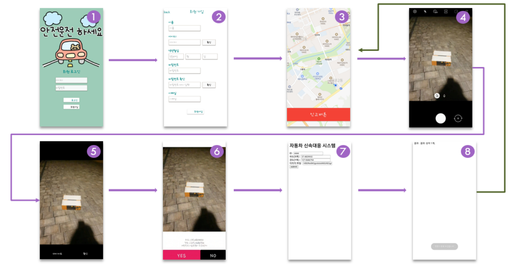
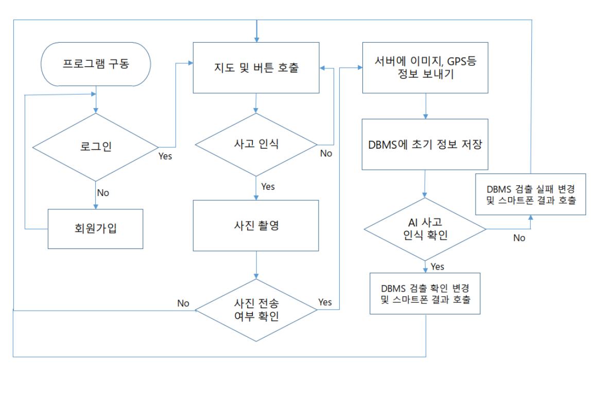

# 자동차 장애물 신속 대처 시스템

## Project (WHY)
 우리가 일상생활에 필요한 것이 무엇이 있을까 생각하였습니다. 조원들과 생각하던 중 <b>"자동차에 AI를 사용할 수 있을까?"</b>라는 개념으로 출발하게 되었으며 이는 장애물로 인한 사고 위치 및 상황을 자동으로 탐지한다는 결과에 이르렀습니다. 현재는 운전자가 신고하려면 ‘한국도로공사’에서 제공하는 앱이나 전화로 많은 단계를 거처 신고를 해야 한다는 불편함으로 신고율이 낮아질 수 있다고 판단하였습니다. 이는 낙하물이 그 자리에서 치워지지 않고 운전자들을 위협할 수 있다는 결론에 도달하였습니다. 또한 많은 양의 신고가 들어왔을 때 각각의 신고 종류를 빠르게 파악할 수 있다면 조금 더 효율적인 처리가 가능해지고 앞으로 완전자율주행이 실현된다면 탑승자가 도로를 주시하지 않아 신고가 더욱 늦어질 수도 있습니다. 이러한 상황을 ‘인공지능으로 해결할 수 있을까?’라는 생각으로 추진하게 되었습니다.

## Stack

### Client (android)
    smartphone - android (JAVA)
    map - naver cloud

### Server
    cloud - groomIDE
    OS - Ubuntu(18.04)
    Frontend - Javascript
    Backend - PHP
    image processing - Python (Base64)
    SQL - MySQL

### AI
    AI - YOLOv5
    Data annotation - YoloLabel
    Using AI, Crawlling - Python (pytorch, selenium)
    {pytorch는 서버와 연동}

## Process

## FileTree
#### PHP
    SQL.php - SQL을 사용 하는 함수를 모은 파일
    checkID.php - 중복되는 ID가 있는지 확인하는 파일
    login.php - 로그인을 할 때 결과를 출력하는 파일
    other.php - AI프로그램 실행, 파일 디코딩등 함수를 모은 파일
    register.php - 계정을 만들 때 처리하는 파일
    request.php - 보낸 자료형을 DBMS에 넣고 인공지능을 돌리는 등 핵심이 되는 파일
#### python
    findObj.py - AI 모델을 돌려 대상이 있는지 파악하는 파일
    string2IMG.py - base64로 변환된 파일을 이미지로 바꾸어 주는 파일
#### ./ (메인 디렉토리)
    ai/best.pt - 인공지능 파일
    upload - 사진이 저장는 폴더
    index.php - 웹뷰로 들어갈때 쓰는 php 파일
    function.js - 자바스크립트 함수를 모은 파일

## License
Pytorch - BSD-style license

Link : https://github.com/pytorch/pytorch#license

Yolov5 - GPL-3.0 license

Link : https://github.com/ultralytics/yolov5