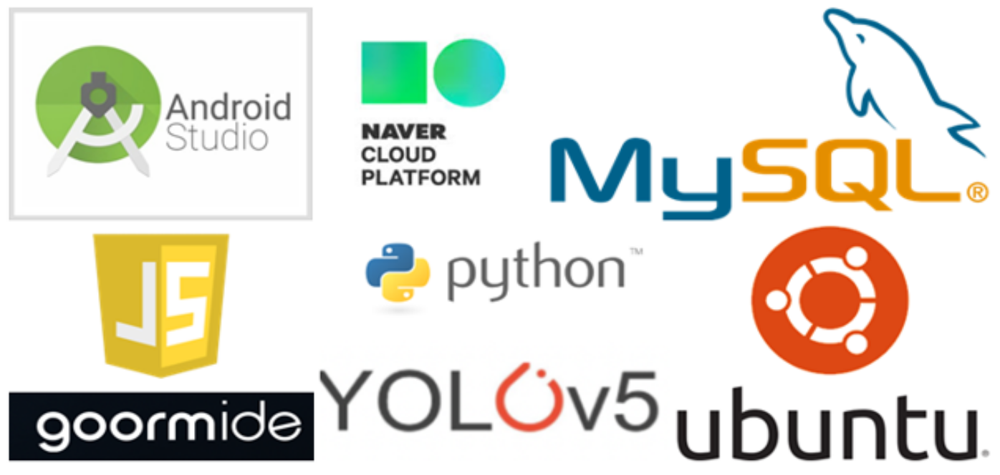

# 자동차 장애물 신속 대처 시스템

## Stack
 +PHP

### Client (스마트폰)
* 스마트폰 - 안드로이드 (JAVA)
* 지도 - 네이버 클라우드

### Server
* 클라우드 - 구름IDE
* OS - Ubuntu(18.04)
* 프론트엔드 및 웹앱 연동 - Javascript
* 백엔드 - PHP
* 이미지 - Python (Base64)
* SQL - MySQL

### AI
* AI - YOLOv5
* 데이터 어노테이션 - YoloLabel
* 인공지능, 크롤링 - Python (pytorch, selenium)
* {pytorch는 서버와 연동}

## Process

UI진행은 다음과 같다

## FileTree
### PHP	
* <b>SQL.php</b> - SQL을 사용 하는 함수를 모은 파일
* checkID.php - 중복되는 ID가 있는지 확인하는 파일
* login.php	- 로그인을 할 때 결과를 출력하는 파일
* <b>other.php</b>	- AI프로그램 실행, 파일 디코딩등 함수를 모은 파일
* <b>register.php</b> - 계정을 만들 때 처리하는 파일
* request.php - 보낸 자료형을 DBMS에 넣고 인공지능을 돌리는 등 핵심이 되는 파일
### python
* findObj.py - AI 모델을 돌려 대상이 있는지 파악하는 파일
* string2IMG.py - base64로 변환된 파일을 이미지로 바꾸어 주는 파일
### ./ (메인 디렉토리)
* ai/best.pt - 인공지능 파일
* upload - 사진이 저장는 폴더
* index.php - 웹뷰로 들어갈때 쓰는 php 파일
* function.js - 자바스크립트 함수를 모은 파일

## Member
* Jihoon(팀장) - AI 구현 및 보완
* <b>Minseob(팀원)</b> - 서버 구현 및 보완
* Soori(팀원) - 임베디드 시스템 작업 및 보완

## License
Pytorch - BSD-style license

Link : https://github.com/pytorch/pytorch#license

Yolov5 - GPL-3.0 license

Link : https://github.com/ultralytics/yolov5
